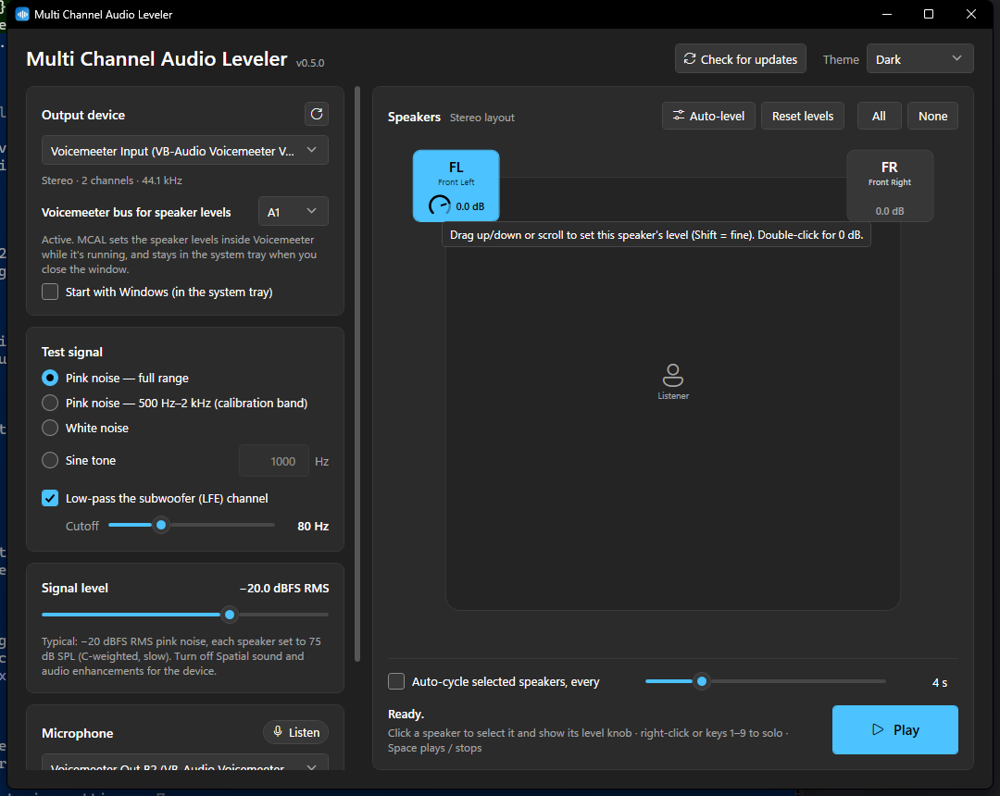

# MCAL — Multi Channel Audio Leveler

**Level stereo and surround speakers on Windows.** MCAL plays a calibrated test signal on any speakers you choose.
You then set each speaker's level by hand with a knob, or let it measure the room with a microphone and level
everything automatically. The levels are applied system-wide, either through Windows or inside **Voicemeeter**.



- **Download:** [latest release](https://github.com/rosscarlson/MCAL/releases/latest) (`MCAL-Setup-x.y.z.exe`)
- **Platform:** Windows 10 / 11, x64
- **Status:** active development (0.x)

---

## Contents

- [Features](#features)
- [Installation](#installation)
- [Leveling your speakers](#leveling-your-speakers)
- [Voicemeeter](#voicemeeter)
- [Reference: controls and shortcuts](#reference-controls-and-shortcuts)
- [Settings, files and command line](#settings-files-and-command-line)
- [Auto-update](#auto-update)
- [Troubleshooting](#troubleshooting)
- [How it works](#how-it-works)
- [Building from source](#building-from-source)
- [Releasing](#releasing)
- [Project layout](#project-layout)
- [Known limitations](#known-limitations)
- [Third-party components and license](#third-party-components-and-license)

---

## Features

**Speaker map that matches your device.** MCAL reads the speaker setup Windows uses for the selected output device
and shows a room diagram for it: Mono, Stereo, Quad, 5.1, 7.1, 7.1.4 and more. If the layout isn't recognized,
it shows a numbered channel grid. Plugging devices in or out, or changing the speaker setup in Windows Sound settings,
refreshes the map automatically.

**Calibrated test signals:**
- Pink noise, full range (20 Hz high-pass)
- Pink noise, 500 Hz–2 kHz, the standard band for speaker calibration
- White noise
- Sine tone, 10 Hz–20 kHz

All signals are **RMS-normalized**, so the level slider (−60 to 0 dBFS RMS) means the same thing whichever signal is
selected. Each channel gets its own **uncorrelated** noise, and channels fade in and out without clicks.

**Subwoofer (LFE) handling.** An optional 24 dB/octave low-pass on the LFE test signal, with an adjustable
cutoff (30–200 Hz, default 80 Hz).

**Per-speaker level knobs.** Select a speaker and a knob appears on its tile. Turning it changes that speaker's level
system-wide, in real time:
- **Windows devices:** sets the Windows per-channel volume (the same values as Sound settings → Levels → Balance),
  from −40 to 0 dB.
- **Voicemeeter devices:** applies a gain inside the chosen Voicemeeter bus, from −40 to +12 dB.

**Microphone leveling:**
- Live mic level meter.
- **Set reference:** lock one speaker's measured level. Every speaker tile then shows its own mic level and its
  difference (**Δ**) from the reference, updated live. Turn each knob until it reads Δ 0.0; a check mark appears
  within ±0.5 dB.
- **Auto-level:** MCAL measures each selected speaker and sets the levels so they all match, checking and adjusting
  over up to three passes.

**Workflow helpers:**
- **Auto-cycle** plays the selected speakers one at a time, switching every 1–15 s.
- Solo a speaker with a right-click or keys 1–9; Space starts and stops.
- All / None selection, and a Reset levels button.

**App:**
- Dark (default), Light, or follow-Windows theme; the title bar matches.
- Auto-update from GitHub Releases.
- Tray mode and start with Windows (used for Voicemeeter).
- Only one copy runs at a time.

---

## Installation

1. Download `MCAL-Setup-x.y.z.exe` from the [latest release](https://github.com/rosscarlson/MCAL/releases/latest).
2. Run it. Windows asks for admin approval, because MCAL installs to `C:\Program Files\MCAL`.
   - The installer isn't code-signed, so SmartScreen may warn: choose **More info → Run anyway**.
3. Launch **Multi Channel Audio Leveler** from the Start menu.

The installer includes everything MCAL needs; .NET doesn't have to be installed separately. Installing a new version
upgrades in place. Installing removes the earlier "Audio Level" builds (0.1–0.3) and moves their settings over.

**Uninstall:** Settings → Apps → *Multi Channel Audio Leveler*. This closes a running copy and removes the
start-with-Windows entry.

---

## Leveling your speakers

### Before you start

- In **Windows Sound settings**, set the output device's speaker configuration (Configure → 5.1, 7.1 …). MCAL shows
  whatever layout Windows reports.
- Turn **Spatial sound** and **audio enhancements** off for the device.
- For SPL-meter calibration, set the Windows volume to 100%, and use your receiver's or amplifier's volume for loudness.
- Place the mic or SPL meter at the main listening position, at ear height, pointing at the ceiling. If you use a
  mic, turn off its "enhancements" / automatic gain in Windows.

### Option A: with an SPL meter (the classic method)

1. Choose the **output device**, the **Pink noise — 500 Hz–2 kHz** signal, and a level of **−20 dBFS RMS**.
2. Select one speaker (right-click it, or press its number key) and press **Play** (or Space).
3. Turn that speaker's **knob**, or your receiver's trim, until the meter reads your target, typically **75 dB SPL,
   C-weighted, slow**.
4. Repeat for each speaker. **Auto-cycle** steps through them for you.

### Option B: with a microphone, by hand

1. In the **Microphone** card, choose your mic and press **Listen**.
2. Solo a reference speaker (Center or Front Left is typical) and press **Play**.
3. Press **Set reference**. MCAL waits for a steady reading and locks it.
4. Solo each other speaker, or use auto-cycle. Its tile shows its mic level and **Δ** from the reference. Turn its
   knob until Δ reads **0.0**; a check mark appears within ±0.5 dB.

### Option C: Auto-level

1. Choose the mic and select the speakers to level, for example **All**.
2. Press **Auto-level**. MCAL:
   - measures the room's background noise,
   - plays each speaker in turn with band-limited pink noise (low-passed noise for the sub),
   - adjusts each speaker's level and re-checks, up to 3 passes, until every speaker is within ±0.5 dB.
3. Which level the speakers are matched to:
   - If a reference is set, all selected speakers are matched to it.
   - If no reference is set and several speakers are selected, they're matched to the **quietest** one. Nothing gets
     louder than your current loudest level.
   - If no reference is set and one speaker is selected, that speaker becomes the reference.
4. Press **Esc** or **Cancel** at any time.

Auto-level stops with a clear message if:
- the mic is clipping,
- a speaker isn't at least 10 dB above the background noise,
- or changing a speaker's level made no measurable difference. This usually means the device ignores Windows channel
  volume, or the wrong Voicemeeter bus is selected.

> The mic readings are **relative** (dB at the mic), not calibrated SPL. That's all leveling needs. Cheap mics often
> under-read deep bass, so check the subwoofer result against a meter or by ear.

---

## Voicemeeter

Voicemeeter **ignores Windows channel volume** (its virtual devices discard it). So when the output device is a
Voicemeeter device, MCAL applies the levels **inside Voicemeeter** instead:

- MCAL connects to Voicemeeter's **bus output insert**, the same mechanism VB-Audio's own *8x8 Matrix* tool uses, and
  applies a gain to each channel of the selected bus in real time.
- Under **Output device**, pick the **Voicemeeter bus** your speakers are on (A1, A2, …; the choices depend on your
  Voicemeeter edition: Standard, Banana or Potato).
- The knobs, Set reference and Auto-level all work as usual, with a range of **−40 to +12 dB**.
- Gains are saved per bus and reapplied automatically when Voicemeeter restarts or changes sample rate.

Things to know:
- **Only one program can use the bus output insert at a time.** If the 8x8 Matrix is running, MCAL shows which program
  has it. Close the Matrix (Voicemeeter → *Other Tools* → *Shut Down Matrix 8x8*); MCAL connects automatically once
  the insert is free.
- **The levels apply only while MCAL is running.** Closing the window keeps MCAL in the **system tray**. Tick
  **Start with Windows** to start it hidden at sign-in. To stop it, use the tray icon → *Exit*, or run
  `MCAL.exe --exit`.
- MCAL works out which bus channel each speaker uses from how Windows lays out the Voicemeeter device.
- If the Voicemeeter Remote API isn't found, MCAL shows a warning and the knobs fall back to Windows channel volume,
  which Voicemeeter ignores.

---

## Reference: controls and shortcuts

| Action | How |
|---|---|
| Play / stop | **Space** or the Play button |
| Select / deselect a speaker | Click its tile |
| Solo a speaker | **Right-click** its tile, or keys **1–9** (number = channel order) |
| Select all / none | **All** / **None** |
| Adjust a speaker's level | Drag the knob up/down (**Shift** = fine), or scroll (0.5 dB; **Shift** = 0.1 dB) |
| Reset one speaker to 0 dB | Double-click its knob |
| Reset all levels | **Reset levels**, then click again to confirm (Windows: all set to the loudest; Voicemeeter: all set to 0 dB) |
| Cancel auto-level | **Esc** or **Cancel** |
| Check for updates | **Check for updates** (header) |
| Change theme | **Theme** dropdown (Dark / Light / System) |

Speaker tiles:
- **Blue** = selected.
- **Pulsing green ring** = currently playing.
- **Second line** = the speaker's name, or once measured, its mic level and Δ from the reference.
- **Bottom line** = the level knob (when selected) and the current level.

---

## Settings, files and command line

| Item | Location |
|---|---|
| Program | `C:\Program Files\MCAL\MCAL.exe` |
| Settings | `%APPDATA%\MCAL\settings.json` |
| Update downloads | `%TEMP%\MCAL-Update\` |
| Start with Windows | `HKCU\Software\Microsoft\Windows\CurrentVersion\Run` → `MCAL` |

Settings saved: theme, output device, mic, signal, level, sine frequency, LFE low-pass and cutoff, auto-cycle, speaker
selection per device, Voicemeeter bus and gains, and `AutoCheckUpdates` (set it to `false` to disable the startup
update check). The mic reference is **not** saved; it lasts for the current session only.

Command line:

| Argument | Effect |
|---|---|
| *(none)* | Start normally, or bring the running copy to the front |
| `--tray` | Start hidden in the system tray (used by Start with Windows) |
| `--exit` | Ask the running copy to exit cleanly (releases Voicemeeter) |

---

## Auto-update

- On startup, and when you press **Check for updates**, MCAL reads the latest release from the GitHub API and compares
  its tag (e.g. `v0.5.0`) with its own version. The startup check is silent unless there's an update.
- When a newer version exists, a banner offers **What's new** and **Install update**. Nothing installs until you
  click.
- **Install update** downloads `MCAL-Setup-x.y.z.exe` and verifies it against the SHA-256 checksum GitHub publishes for
  the file. It then runs the installer with `/SILENT` (Windows asks for admin approval) and closes MCAL.
- The installer upgrades in place and reopens MCAL as the signed-in user (not as admin).

Requirements: the repository and its releases are public, and each release has an `MCAL-Setup-*.exe` attached.

---

## Troubleshooting

| Problem | Fix |
|---|---|
| SmartScreen blocks the installer | **More info → Run anyway** (the installer isn't code-signed). |
| Knobs don't change what you hear (Windows device) | Some drivers and virtual devices ignore per-channel volume. Auto-level detects this. Use the physical output device. |
| Knobs don't change what you hear (Voicemeeter) | Check the **bus** selection under Output device. Check the status there; if it says the insert is in use, close the 8x8 Matrix. |
| "Voicemeeter's bus insert is in use by …" | Another program (usually the 8x8 Matrix) holds the insert. Close it; MCAL connects automatically. |
| Levels reset when MCAL is closed (Voicemeeter) | Expected: the gains are applied by MCAL. Keep it in the tray, and tick **Start with Windows**. |
| "Windows blocked microphone access" | Settings → Privacy & security → Microphone → turn on *Let desktop apps access your microphone*. |
| Mic shows **CLIPPING** | Lower the mic gain in Windows, or lower the signal level. |
| "Couldn't hear … above the background noise" | Raise the signal level or mic gain, move the mic closer, or quiet the room. |
| Wrong speaker layout shown | Set the speaker configuration in Windows Sound settings → the device → *Configure*, then press refresh (⟳). |
| Test tone plays but nothing is heard | Check that Voicemeeter routes the Voicemeeter Input strip to the bus your speakers are on, and that the bus isn't muted. |

---

## How it works

### Audio output
- Playback uses **WASAPI shared mode** through NAudio. The signal is produced in the device's own mix format, so each
  speaker channel maps straight through.
- The speaker map comes from the format's speaker mask (the speaker-position bits Windows reports). Channels appear in
  ascending bit order and are placed on a 600×560 logical room diagram.
- **Pink noise:** Paul Kellet's refined filter, plus a 20 Hz high-pass. The calibration band uses 4th-order
  (Linkwitz-Riley) high- and low-pass filters at 500 Hz and 2 kHz. The LFE signal is low-passed the same way at the
  cutoff.
- **Normalization:** at startup MCAL measures each signal type's RMS at the device sample rate (3 s after a 0.5 s
  warm-up), so every signal plays at exactly the level the slider shows.
- **Gain changes** use a ~15 ms exponential fade, so starting, stopping and switching channels don't click.

### Level control
Both kinds of level control share one interface (`ILevelControl`):
- **`ChannelVolume`** sets the Windows per-channel volume. Windows keeps the master volume equal to the loudest
  channel, and moving the master shifts every channel equally, so balance is preserved. Some devices expose more
  volume channels than speakers (e.g. 8 on a virtual device set to stereo); MCAL maps speakers to them by position
  using the device's native format.
- **`VoicemeeterLevels`** sets MCAL's own gains in the Voicemeeter bus output insert. The audio callback
  (`VoicemeeterRemote`) runs in real time: no memory allocation, no locks, and it ramps the gain across each audio
  frame. A 2-second watchdog restarts the stream when Voicemeeter reports a change, and reconnects after Voicemeeter
  restarts.

### Microphone measurement
- WASAPI capture, first mic channel only. Power is measured in three bands at once: full range (20 Hz high-pass),
  the calibration band (400 Hz–2.5 kHz) and the sub band (20 Hz to 1.5× the LFE cutoff).
- **Live readings** are a 1.5 s rolling average, which restarts when a different speaker starts playing or its knob
  moves.
- **Δ** = (speaker's mic level − its signal level) − (reference mic level − reference signal level). If the Windows
  master volume moves all channels together, MCAL subtracts that shared shift, so changing the volume doesn't upset Δ.
- **Auto-level** measures 1.5 s per speaker after a 0.8 s settling time. It sets each level to
  `current + (target − measured)` and repeats until every speaker is within ±0.5 dB, for at most 3 passes.

---

## Building from source

Requirements:
- Windows 10/11
- .NET 8 SDK
- Inno Setup 6 (`winget install JRSoftware.InnoSetup`), for the installer

```powershell
git clone https://github.com/rosscarlson/MCAL.git
cd MCAL
dotnet build src\MCAL\MCAL.csproj -c Release   # app only
.\build.ps1                                    # self-contained build + installer -> artifacts\MCAL-Setup-<version>.exe
.\build.ps1 -Version 0.6.0                     # override the version
```

`build.ps1` publishes a self-contained, single-file `win-x64` build and compiles `installer\MCAL.iss` with Inno Setup.

---

## Releasing

1. Bump `<Version>` in `src/MCAL/MCAL.csproj` and commit.
2. **Launch the built app once** (smoke test) before tagging.
3. Tag the commit and push the tag:
   ```powershell
   git tag v0.6.0
   git push origin v0.6.0
   ```
4. The **Release** workflow (`.github/workflows/release.yml`) builds `MCAL-Setup-0.6.0.exe` on a Windows runner and
   publishes it as a GitHub Release with generated notes. Installed copies are offered the update on their next check.

The **CI** workflow builds every push to `main` and every pull request.

---

## Project layout

```
MCAL.sln
build.ps1                     self-contained publish + Inno Setup installer
installer/MCAL.iss            installer: Program Files\MCAL, fixed AppId, clean exit/uninstall, legacy cleanup
.github/workflows/            ci.yml (build), release.yml (tag -> GitHub Release)
docs/screenshot.png
tools/make-icon.ps1           regenerates src/MCAL/Assets/MCAL.ico
src/MCAL/
  App.xaml(.cs)               startup, single instance, --tray / --exit, theme
  MainWindow.xaml(.cs)        UI and app logic (devices, playback, mic, reference, auto-level, Voicemeeter, tray, updates)
  AppSettings.cs              JSON settings (+ migration from "Audio Level")
  Audio/
    DeviceService.cs          output/input device lists and change notifications
    SpeakerLayout.cs          speaker mask -> named, positioned speakers
    TestSignalProvider.cs     signal generator (pink/band/white/sine, LFE low-pass, normalization, fades)
    Biquad.cs                 audio filter building block
    ILevelControl.cs          common interface for level control
    ChannelVolume.cs          Windows per-channel endpoint volume
    SpeakerChannelMap.cs      speaker -> device native channel mapping
    MicMeter.cs               mic capture and band-filtered level measurement
  Voicemeeter/
    VoicemeeterRemote.cs      Voicemeeter Remote API binding + real-time bus insert callback
    VoicemeeterLevels.cs      per-speaker gains inside a Voicemeeter bus
  Controls/TrimKnob.cs        rotary level knob
  ViewModels/SpeakerVm.cs     speaker tile state (selection, playing, level, mic reading, Δ)
  Updates/UpdateService.cs    GitHub Releases check, verified download, installer launch
  Theming/ThemeManager.cs     Dark/Light/System palette switching, dark title bar
  Themes/                     Dark.xaml, Light.xaml (colors), Controls.xaml (control styles)
```

The UI design system (colors, layout, components) is documented separately for reuse in other apps, in
`D:\OneDrive\Code\Windows\design.md` on the author's machine.

---

## Known limitations

- **Not code-signed:** SmartScreen warns on first install.
- **Voicemeeter:** levels apply only while MCAL runs, and it can't run alongside the 8x8 Matrix or any other
  bus-insert tool. The 8x8 Matrix's saved gains aren't imported.
- **Mic readings are relative**, not calibrated SPL. Subwoofer accuracy depends on the mic's bass response.
- **Mic channel 1 only;** multi-channel mic arrays aren't averaged.
- **The reference isn't saved** between sessions.
- **The pink-noise filter is tuned for 44.1/48 kHz;** at 96 kHz and above, the spectrum tilts slightly in the lowest
  octaves (levels stay RMS-correct).
- **Per-speaker distance/delay and EQ** (room correction) aren't implemented.

---

## Third-party components and license

| Component | Use | License |
|---|---|---|
| [NAudio](https://github.com/naudio/NAudio) (`NAudio.Wasapi`, `NAudio.Core`) | WASAPI playback/capture, Windows volume | MIT |
| .NET 8 runtime (bundled in the installer) | Runtime | MIT |
| [Inno Setup](https://jrsoftware.org/isinfo.php) | Installer | Inno Setup license (free, including commercial use) |
| Voicemeeter Remote API (`VoicemeeterRemote64.dll`, from the user's Voicemeeter install; not shipped) | Voicemeeter bus insert | VB-Audio terms |
| Segoe Fluent Icons (Windows system font; not shipped) | UI icons | Microsoft |

**No license has been chosen for MCAL itself yet.** Until one is added, all rights are reserved by the author.
